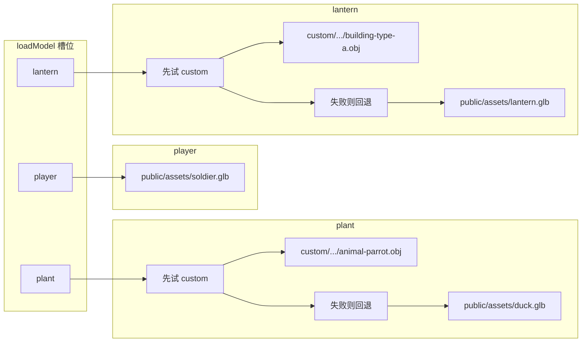

# 资源分布示意

说明 **静态文件放哪**、**代码里从哪条路径加载**。运行时 **不联网下载**；换机器请拷贝整个 `public/assets`（或至少下文「运行必需」所列）。

---

## 1. 目录树（逻辑示意）

```
public/
└── assets/
    ├── soldier.glb          ← 推荐：npm run download-assets 或手动放入（角色）
    ├── duck.glb             ← 同上（田里 plant 槽回退）
    ├── lantern.glb          ← 同上（远景 lantern 槽回退）
    ├── THIRD-PARTY-MODELS.txt
    └── custom/              ← 自购 / Kenney 等整包解压（可选但当前配置会优先读其中部分）
        ├── README.txt
        ├── License.txt
        └── Models/
            └── OBJ format/   ← 大量 .obj + .mtl + Textures/
                ├── animal-bunny.obj    … 插花台兔（代码写死路径）
                ├── animal-cat.obj      … 插花台猫
                ├── animal-parrot.obj   … plant 槽优先（assetPaths）
                ├── building-type-a.obj … lantern 槽优先
                └── …（树木、建筑、更多动物等，包内自带，默认游戏不逐个引用）
```

**实际仓库**里 `custom/Models/OBJ format/` 下文件很多；上表只标 **当前 TypeScript 里直接引用** 的条目，其余为素材库储备。

---

## 2. 代码槽位 → 文件（配置入口）

配置在 **`src/config/assetPaths.ts`**，经 **`loadModel(slot)`** 与 **`loadSceneResource`** 加载。



| 槽位 | 优先（当前配置） | 回退 |
|------|------------------|------|
| `player` | 仅 `assets/soldier.glb` | 无（引擎保留胶囊人） |
| `plant` | `assets/custom/Models/OBJ format/animal-parrot.obj` | `assets/duck.glb` |
| `lantern` | `assets/custom/Models/OBJ format/building-type-a.obj` | `assets/lantern.glb` |

URL 相对网站根，即 Dev 环境下一般为 `/assets/...`。

---

## 3. 与槽位无关的「写死路径」资源

| 用途 | 文件（相对 `public/`） | 代码位置 |
|------|-------------------------|----------|
| 插花台兔占位 | **优先** `assets/animal-bunny.glb` 或 `assets/custom/animal-bunny.glb`，失败再用 `…/animal-bunny.obj` | `ArrangementModule.ts` |
| 插花台猫占位 | **优先** `assets/animal-cat.glb` 或 `assets/custom/animal-cat.glb`，失败再用 `…/animal-cat.obj` | `ArrangementModule.ts` |
| 邻园主人模型 | 与玩家相同：`loadModel('player')` → `soldier.glb` | `friendGardenChaser.ts` |

---

## 4. 程序生成（非 assets 文件）

下列 **不对应** `public/` 下独立模型文件，由代码生成网格/材质：

| 内容 | 说明 |
|------|------|
| 地面、天空、雾、太阳光、网格辅助线 | `Engine.ts`、纹理工具 |
| 自家 / 邻园田埂、土壤、茎与五种花冠 | `GardenPlots.ts`、`FriendGardenPlots.ts`、`gardenPlantMeshes.ts` |
| 插花台圆毯、展台 | `arrangementStation.ts` |
| 地面散石 | `SceneDecor.ts` |

---

## 5. 运行时数据（非资源文件）

| 数据 | 位置 |
|------|------|
| 玩家进度 | `localStorage`，键名 `fthtml-yws-save-v1`（见 `saveLocal.ts`） |

---

## 6. 与《资源规划》的关系

- **`docs/资源规划.md`**：换模流程、格式、动画命名、表格维护约定。
- **本文**：一眼看清 **东西在磁盘哪、谁加载**，附简单流程图。

---

（完）
